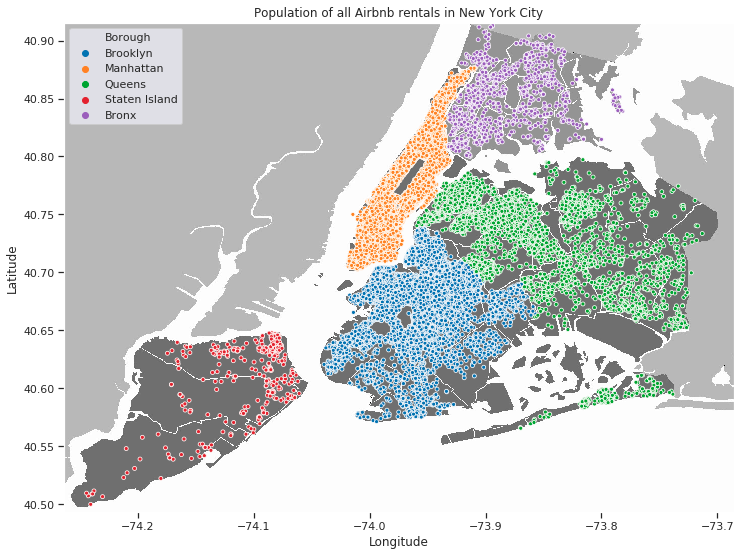

# An Airbnb Exploration of New York City
< tech stack goes here >

-----

When I set out on the long journey that this project was (all five days of it), I was just a wee sprout of a data scientist. I found this relatively new and unused Kaggle dataset, and I thought to myself, "_I miss this big city that I grew up around; wouldn't it be cool if..._" and not much more. I _wanted_ a bigger question -- perhaps something with more gravitas, or one whose answer could actually impact peoples' lives -- but that _wouldn't it be cool_ question just kept invading my thoughts. So, eventually, I followed that impulse, as all artists are taught they should do.  
I tried to make the best of it, expecting that my audience (or customers, clients, or whomever) would maybe, at best, gain a better understanding or picture of the Airbnb market in New York. I'll admit, it was a little didactic and so I struggled to invent a question that this dataset could answer. But follow me down this rabbit hole -- I doubt you'll be disappointed.

### Initial Analysis

One of the very first interesting things I found was that the dataset had over 48,000 observations -- for my very first legit data science project, I was _beyond_ impressed. But more importantly, in a city that covers only 302 square miles (782 square km) of land, that's over _158 Airbnb rental properties per square mile_ (or over 61 per square km). If we look at that in map form, it looks a little something like this:

    

If we remove the map from underneath all those datapoints, we'd still be able to clearly define all five Boroughs of New York City. That's insane. Here's a look at those 48,000 Airbnb rentals and how they're divided up between each Borough:

I started to wonder, though. With over 48,000 possible places for someone to rent on any given day, surely many of these Airbnb rentals must be dirt cheap, right? Well, after a little exploration and data wrangling -- which, honestly, can feel like herding cats sometimes -- I had my answer.  
(And a fancy graph or two, too!)

| Minimum price  | Maximum price  |
| -------------: | --------------:|
|         $0.00  |     $10,000.00 |

You're probably thinking to yourself now, much like I was, "_Wait, there are Airbnb's available for $0 per night, and others for $10,000 per night???_" Like I said, this comes with some cool graphs, and this is kind of where it starts to get interesting:

You'll probably notice that I capped the graph at ~$4,000. I did this to preserve readability in the sub-$500 range, where _most_ of the dataset is found -- if I left it uncapped, the boxes would have just been flat lines, because remember: someone, somewhere, is paying $10,000 per night to stay somewhere in Manhattan. You can even see this discrepancy in the graph as it is. All the black dots are considered data (or prices) that fall outside the normal or most common range for that Borough and rental style, and the higher you go the less and less common they get.

That's some good information to have for anyone thinking of maybe traveling to New York, but I wanted to go a little deeper, to get a closer look at this price data; surely there must be something _even more interesting_ there, right?

The first thing that jumped out at me when I was looking at the price data this way was that _whoa, 48,000 data points is just waaaay too much_, so I pared it down a bit by taking a random sample of only 8,000 units, or roughly 1/6 of total observations -- any sample size much larger than that just turned Brooklyn, Manhattan, and Queens into solid colors, and that's just not helpful at all.  
But looking at the data this way shows some interesting phenomena:  
  * First, a sort of stratification appears between the rental styles. At the very bottom, in the green, are the _Shared room_ listings; and the next category up, and a little more expensive, are the _Private room_ listings (orange); and then above those, and even more expensive, are the listings for _Entire homes/apts_.  
  * Next, there are also certain price intervals that Hosts in each Borough seem to gravitate towards or around, and they're not always the same from Borough to Borough.  
  * Lastly, it seems those $0 per night rentals are in Brooklyn (are they _really_ free, though?), and some people are actually willing to pay $800 per night for a _Shared room_ in Manhattan. What.

### I still wanted more, though

Raw data like that wasn't enough. I went back to my dataset and eventually noticed some things that just didn't look right to me, like rentals that had a minimum stay of 30 days, or host IDs that were associated with more than 50 listings each. This was data that I had originally discarded, thinking it was extraneous, or unimportant, or that there just wasn't anything _interesting_ there.

| Minimum nights > 30  | Minimum nights > 180  | Minimum nights > 360  |
| -------------------: | ---------------------:| ---------------------:|
|                 747  |                   81  |                   44  |

Quite the contrary, though. This is actually _really interesting_. There are over 700 listings in the city that are classified as requiring _at least_ a 30-day rental duration. I couldn't help but ask why. "_This seems really strange, what law are they trying to get around?_" I thought to myself. Turns out, there's a statewide law in New York that prevents rentals of less than 30 days in multi-family buildings of any kind -- which means it's _these_ orange dots that are lawful units, _especially_ in Manhattan. How many single-family buildings do you know of in Manhattan? I am _definitely_ suspicous of the 44 listings that ask for a 360-day minimum stay, though. _A renter might as well just sign a lease at that point._

Moving on, after that discovery, I also became quite suspicious of hosts that are listing more than 30 rentals _each_. Here are the top 10 host IDs, by number of rental properties they have listed:

| Host ID  | Number of properties  |
| -------------: | --------------:|
| 219517861      | 327            |
| 107434423      | 232            |
| 30283594       | 121            |
| 137358866      | 103            |
| 12243051       |  96            |
| 16098958       |  96            |
| 61391963       |  91            |
| 22541573       |  87            |
| 200380610      |  65            |
| 7503643        |  52            |

I don't have an explanation for this (yet), except _maybe_ these hosts are trying to skirt some sort of property management laws, regulations, or fees by listing through Airbnb. I feel like I'm reaching with those guesses, but to be fair I also felt like I was reaching with my initial _minimum stay_ hunch (or __hypothesis__). That said, that previous suspicion still bore valuable fruit. Even though it basically confirmed the _inverse_ of my hypothesis, it still revealed that _something_ was amiss. So, there just might be something going on here -- something interesting and maybe worth some deeper investigation. 

Another time, perhaps.

-----

